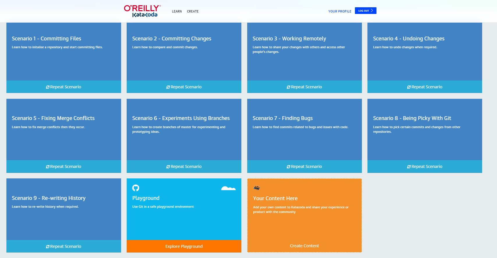

# Home Task Git

## Task #1 Watch Videos
done 
***

## Task #2 Pass practical course
[https://www.katacoda.com/courses/git](https://www.katacoda.com/courses/git)

***

### Task #3 Pass practical scenario 
[https://www.katacoda.com/aossama/scenarios/git-scm-lab-101](https://www.katacoda.com/aossama/scenarios/git-scm-lab-101)

___
### Task #4 Pass practical scenario 
[https://www.katacoda.com/aossama/scenarios/git-scm-lab-102](https://www.katacoda.com/aossama/scenarios/git-scm-lab-102)

---
#### Task #5 Pass practical scenario 
[https://www.katacoda.com/aossama/scenarios/git-scm-lab-201](https://www.katacoda.com/aossama/scenarios/git-scm-lab-201)

---
#### Task #6 Pass practical scenario 
[https://www.katacoda.com/aossama/scenarios/git-scm-lab-202](https://www.katacoda.com/aossama/scenarios/git-scm-lab-202)