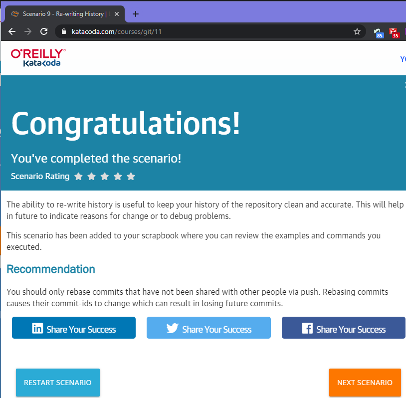
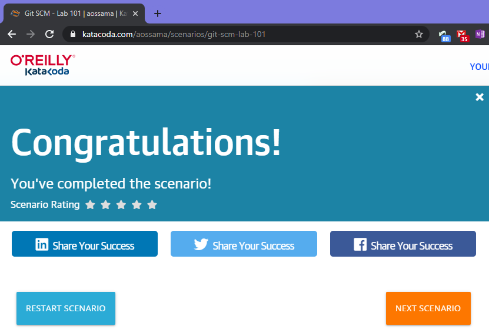

# Yuhen Kaveryn Katacoda scenarios report.md

######  Report Scenario 1 - Committing Files

###### Report Scenario 2 - Committing Changes

###### Report Scenario 3 - Working Remotely

###### Report Scenario 4 - Undoing Changes

###### Report Scenario 5 - Fixing Merge Conflicts

###### Report Scenario 6 - Experiments Using Branches

###### Report Scenario 7 - Finding Bugs

###### Report Scenario 8 - Being Picky With Git

###### Report Scenario 9 - Re-writing History

###### Report Practical scenario 1

###### Report Practical scenario 2

###### Report Practical scenario 3

###### Report Practical scenario 4

