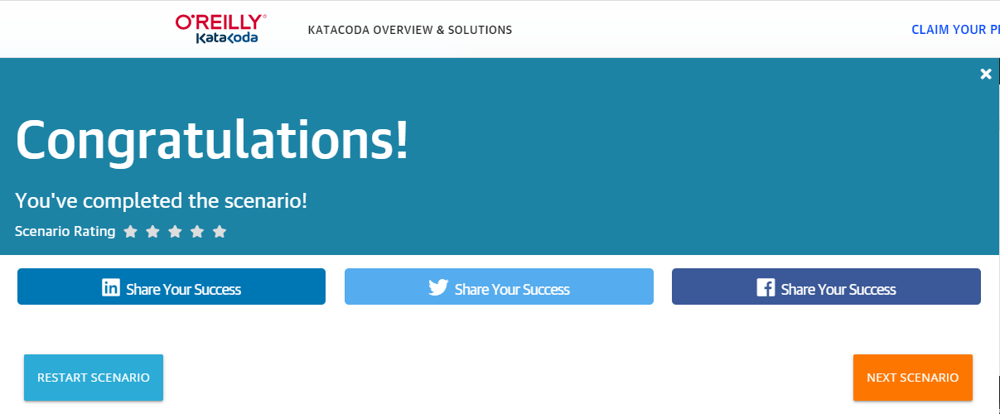
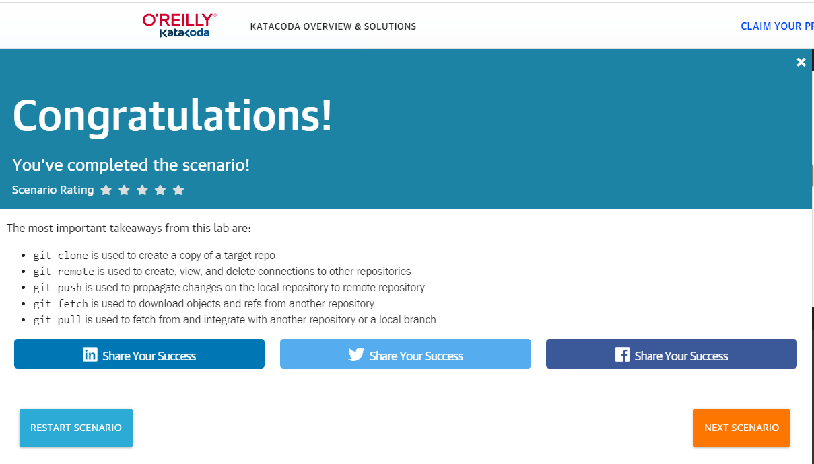
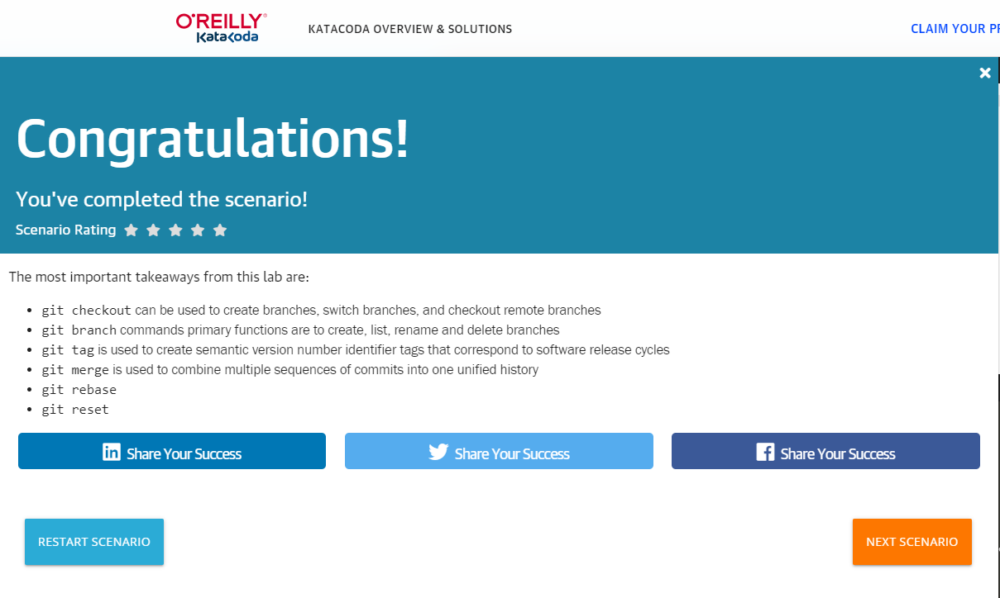
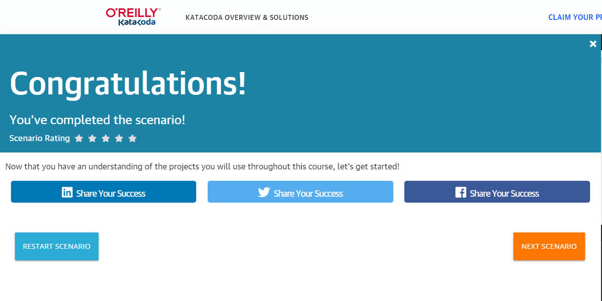

# Homework report
## Completed by _Yauheni_Vaitsiakhouski_

### Task:
1) Watch Videos ( Recommended)  
  Completed!
3) Pass practical course https://www.katacoda.com/courses/git 

3) Pass practical scenario https://www.katacoda.com/aossama/scenarios/git-scm-lab-101 

4) Pass practical scenario https://www.katacoda.com/aossama/scenarios/git-scm-lab-102 

5) Pass practical scenario https://www.katacoda.com/aossama/scenarios/git-scm-lab-201 

6) Pass practical scenario https://www.katacoda.com/aossama/scenarios/git-scm-lab-202 

